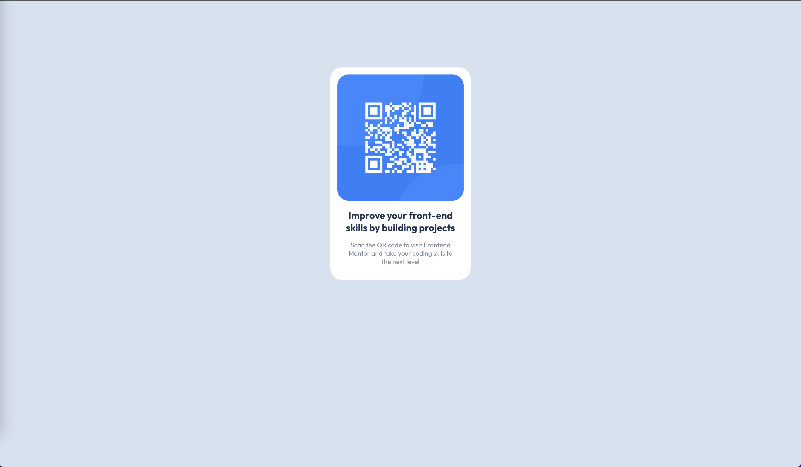

# Frontend Mentor - QR code component solution

This is a solution to the [QR code component challenge on Frontend Mentor](https://www.frontendmentor.io/challenges/qr-code-component-iux_sIO_H). 

## Overview

### Screenshot

### Links

- Solution URL: [here](https://your-solution-url.com)
- Live Site URL: [here](https://your-live-site-url.com)

### Built with

- CSS, HTML
- [React](https://reactjs.org/) - JS library

## Author

- Frontend Mentor - [@mgrochalski](https://www.frontendmentor.io/profile/mgrochalski)

